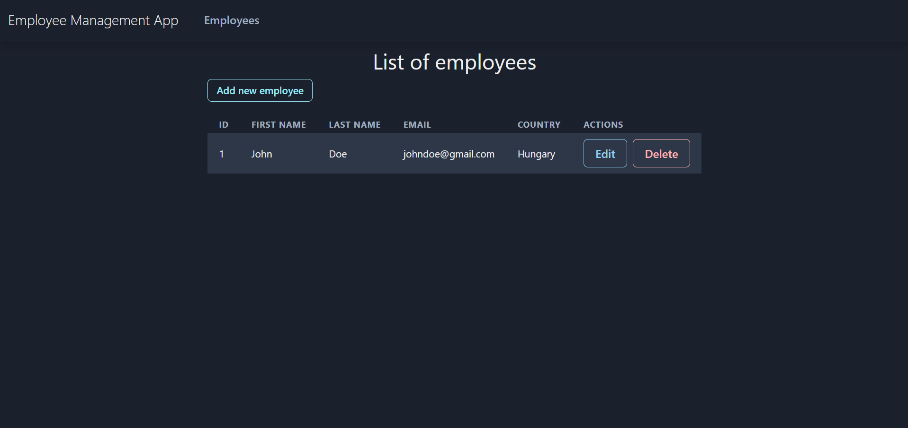

# employee-management-system

## Features

- CRUD operations on employees
- Toast message

## API routes

- GET request to `/employee` - Gets all employees
- GET request to `/employee/{id}` - Gets an employee with a specified id
- POST request to `/employee` - Creates a new employee
- PUT request to `/employee/{id}` - Updates an employee with a specified id
- DELETE request to `/employee/{id}` - Deletes an employee with a specified id

## H2 database

This application uses H2 in-memory database for development purposes.

## React frontend preview

